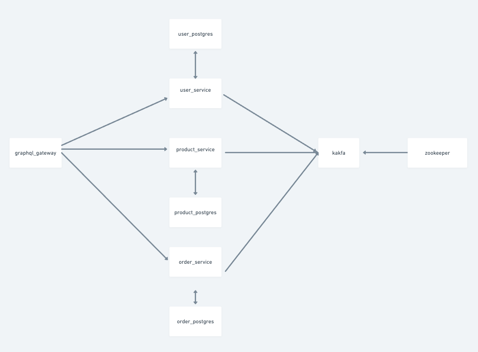

## Description

This is an overview of a microservices architecture with multiple services, including user management, product management, order processing, a Kafka messaging system, and a Graphql API to interact with the application. To start the application, you'll need to setup the `docker compose` file, mentioned in the root of the direcotory. *The containers running in the microservices don't maintain any volume , so any data will be lost when the containers are stopped.* The microservices handle their own databases. `user_service`, `product_service` and `order_service` exposes **REST** endpoints to the `graphql_gateway`.  The `graphql_gateway` exposes a **GraphQL** endpoint to the outside world to interact with the application.  The `kafka` service is used by services to communicate with each other to maintain consistency of the system. Authentication happens at the the container level i.e. the `JWT_SECRET` is shared between the services and the users are authenticated at the service containers and not at the gateway. And the ports of the containers and their databases are exposed to the host machine. 

**Tools used in this assignment**
- NodeJS
- Express
- Postgres
- yarn (package manager)
- Sequelize
- Kafka 
- Docker
- JWT

## To run the code
1. Install Docker in your system
2. Clone the repo
    `https://github.com/Anu-Ra-g/Pratilipi-Assignment.git`
3. Setup the docker compose file
    `docker compose up`
4. Then you connect to the application, locally on localhost port 4000
    `http://localhost:4000/graphql`

Then you will be presented  with a GraphQL API, where you can query the data, as your wish. You can use this [Postman collection](https://www.postman.com/adsf99/workspace/pratilipi/collection/66fe989e083131f0be3e7a0c?action=share&creator=27215646) to test the API *after the graphql server starts running*.

